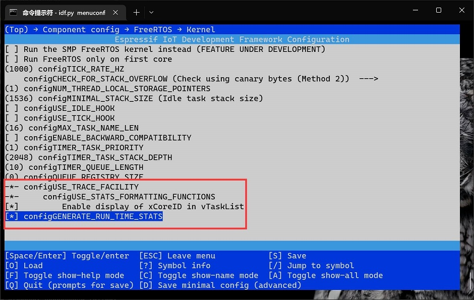

# Task Monitor

## Usage
### setup menuconfig

### create monitor task
```c
#include <taskMonitor.h>
...
// start a monitor task which statistics all tasks every 100000ms.
startTaskMonitor(10000);
```


## Result

It will print task status like this every 10s.

`Task`: Name of task.
`Stack`:The minimum amount of stack space that has remained for the task since the task was created.  
`Running Time`:The total run time allocated to the task so far in this round.  
`Percentage`:The percentage of the total time this task runs in this round.


```
+-------------------------------------------------+
| Task        | Stack | Running Time | Percentage |
*-------------------------------------------------*
| TaskMonitor | 828   | 9537         | 0%         |
|-------------|-------|--------------|------------|
| main        | 1132  | 7207218      | 36%        |
|-------------|-------|--------------|------------|
| IDLE        | 820   | 9997215      | 49%        |
|-------------|-------|--------------|------------|
| IDLE        | 736   | 2237598      | 11%        |
|-------------|-------|--------------|------------|
| cam_task    | 564   | 557566       | 2%         |
|-------------|-------|--------------|------------|
| esp_timer   | 1248  | 0            | 0%         |
|-------------|-------|--------------|------------|
| ipc1        | 576   | 0            | 0%         |
|-------------|-------|--------------|------------|
| ipc0        | 3368  | 0            | 0%         |
+-------------------------------------------------+
```

## Libtable
Data is formatted as a table by libtable.  
https://github.com/marchelzo/libtable
There is memory leak issues on origin code,I fixed it in this fork.
https://github.com/liux-pro/libtable
